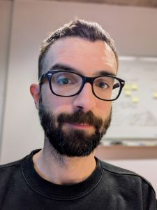

Tijs. He/him. 39, born and bred in Belgium, currently living in Brussels with a boyfriend and a cat. 

During office hours I'm an EdTech policy advisor at KU Leuven's Faculty of Arts. But I'm not here to talk about work.

During my downtime I read, watch TV and/or movies, or play ~~video games~~ CK3. I also spend a fair bit of time cooking - and am halfway decent at it, too - and studying languages. I'm currently taking night classes in Polish and Swedish. 

I'm a homebody. When I do leave the house it's usually to go to the movies, though I also enjoy bars and restaurants, hikes, the odd board game or two and trips aproad. 

Truly, I'm nothing unusual.

## About this website
I used to blog. Blogger, Wordpress, LiveJournal, Tumblr ... You name it, I was on it. 

Then I stopped. It's been half a decade since I last published anything more substantial than an Instagram story. In recent times I've been missing it though and so, after a lot of soul-searching, a bit of research as well as a couple of prematurely aborted attempts, I'm now ready to put my stuff out there again.

I'm doing it a little bit differently this time around, with a set-up that puts everything firmly under my control. I just don't want to be at the mercy of whichever corporation owns the platform I publish on anymore and I want to challenge myself to really make this space my own. I enjoy to dabble in code and I want to do more of it.

This website is my personal playground, to mess around with writing and web design. For right now, though, it really is just a dime-in-a-dozen blog.

My interests are manifold. There are a few domains that interest me in particular - books (predominantly speculative fiction), TV shows and films, languages, and technology - and I expect I'll mainly be talking about those on here. That said, this website does not have a set range of topics, and nothing is off bounds.

## Credit
I'm building this website using Github and Jekyll. I set up the structure using [this Github Pages template](https://github.com/skills/github-pages) and I'm using [Minima](https://github.com/jekyll/minima) (the default Jekyll theme) as a jumping off point for the blog's layout and styling, though I have made some minor tweaks and plan to make more. Thank you to the people maintaining the [instructions](https://github.com/jekyll/minima/blob/master/README.md) on how to make those changes; they've been a great help.
