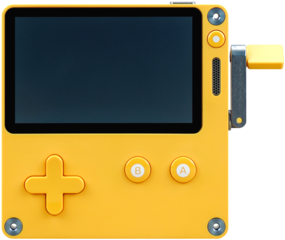

Now-page inspired by <a href="https://sive.rs/nowff">Derek Sivers</a>. July edition.

## What I'm doing now

- **Going to the movies**. I've been a proud holder of a <a href="https://cinevillepass.be/en-BE" target="_blank">Cineville Pass</a> for only a few weeks, but since I've had it I've been to the cinema weekly, seeing movies I probably wouldn't have gone to see in cinema (or seen at all) if I had had to pay for a regular ticket. It's been a blast.
- **Checking out my Playdate**. My boyfriend gave me a <a href="https://play.date/" target="_blank">Playdate</a> for my birthday. It's honestly such a nifty little gaming device, perfect for a casual gamer who likes his games to look cute and aesthetically pleasing such as myself. Favourite game to play on it so far is <a href="https://play.date/games/summit/" target="_blank">Summit</a>.
- **Starting a blog**. You're on it. More about that [here](/about.md).

## This month
#### Activities
- The Belgian national team got booted out off the UEFA European Football Championship by France. I saw the game with friends, in a brown bar in Hasselt, which is a great way to do it.

#### Reading
**Currently reading**: *Into the Narrowdark* by Tad Williams

**Finished**: 

None so far

#### Cinema visits
None so far
