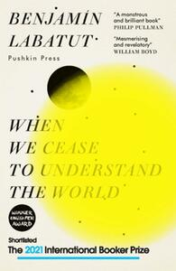

## Currently reading

<strong><i>When We Cease to Understand the World</i></strong> by Benjamín Labatut, translated by Adrian Nathan West

## Finished
1. Tad Williams, *To Green Angel Tower* (Memory, Sorrow, and Thorn #3)
2. Simon Jimenez, *The Vanished Birds*
3. James S.A. Corey, *Memory's Legion* (The Expanse #10)
4. Tochi Onyebuchi, *Riot Baby*
5. Isaac Asimov, *Prelude to Foundation* (Foundation #6)
6. Peter Straub, *Ghost Story*
7. Isaac Asimov, *Forward the Foundation* (Foundation #7)
8. R.F. Kuang, *Babel, Or the Necessity of Violence: An Arcane History of the Oxford Translators’ Revolution* &#187; <a href="{{site.baseurl}}/2024/11/27/Beyond-Time-for-Stories-Like-These.html">Blogpost</a>
9. J.M. Barrie, *My Lady Nicotine*
10. Elżbieta Cherezińska, *The Last Crown* (The Bold #2) &#187; <a href="{{site.baseurl}}/2024/12/01/A-Woman-in-All-Her-Messy-Glory.html">Blogpost</a>
11. Erik J. Wagner, *An Unnatural Life*
12. Tad Williams, *Brothers of the Wind* (The Last King of Osten Ard #0.75)
13. Tad Williams, *The Heart of What Was Lost* (The Last King of Osten Ard #0.5)
14. Tad Williams, *The Witchwood Crown* (The Last King of Osten Ard #1)
15. Tad Williams, *Empire of Grass* (The Last King of Osten Ard #2)
16. Tad Williams, *Into the Narrowdark* (The Last King of Osten Ard #3)
17. Raymond Carver, *What We Talk About When We Talk About Love*
18. Walter M. Miller Jr., *A Canticle for Leibowitz* &#187; <a href="{{site.baseurl}}/2024/12/12/The-Futility-of-Hoping.html">Blogpost</a>
19. George R.R. Martin, *Fire & Blood* (A Targaryen History #1)
20. Max Porter, *Grief Is The Thing With Feathers*
21. James Tiptree Jr., *Her Smoke Rose Up Forever*
22. Martin MacInnes, *In Ascension*
23. Stephen R. Donaldson, *Lord Foul's Bane* (Thomas Covenant #1)
24. Stephen R. Donaldson, *The Illearth War* (Thomas Covenant #2)
25. Stephen R. Donaldson, *The Power That Preserves* (Thomas Covenant #3)
26. Alix E. Harrow, *The Ten Thousand Doors of January* &#187; <a href="{{site.baseurl}}/2024/11/27/Beyond-Time-for-Stories-Like-These.html">Blogpost</a>
27. Tad Williams, *The Navigator's Children* (The Last King of Osten Ard #4)
